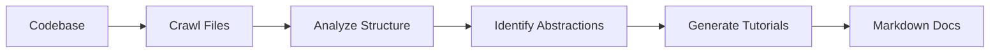

# Salt Docs CLI

AI-powered tool that analyzes codebases and generates beginner-friendly documentation.

## How it works



## Installation

```bash
pip install -r requirements.txt
```

## Setup

Configure your LLM API key in `utils/call_llm.py`:

```python
client = genai.Client(
  api_key=os.getenv("GEMINI_API_KEY", "your-api_key"),
)
```

## Usage

### Analyze GitHub repository
```bash
python main.py --repo https://github.com/username/repo --include "*.py" --exclude "tests/*"
```

### Analyze local directory
```bash
python main.py --dir /path/to/your/codebase --include "*.py" --exclude "*test*"
```

### Options
- `--repo` or `--dir` - GitHub repo URL or local directory path
- `--include` - File patterns to include (e.g., "*.py", "*.js")
- `--exclude` - File patterns to exclude (e.g., "tests/*", "docs/*")
- `--output` - Output directory (default: ./output)
- `--language` - Language for generated docs (default: "english")
- `--max-size` - Maximum file size in bytes (default: 100KB)
